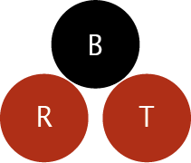

## Red Black Tree &middot; [](https://opensource.org/licenses/MIT) &middot; [](https://github.com/mateuszstompor/RedBlackTree/actions/workflows/tests.yml)

<p align="center">
  
</p>

### About
This is a macOS framework that implements a generic red-black tree, modeled after Foundation containers. Designed for flexibility and extensibility, it serves as a foundational, key-only data structure. You can subclass the main tree to create higher-level containers such as dictionaries, by defining specialized types that associate keys with values. The interface is familiar to developers who have used Foundation containers, and the framework is thoroughly tested for reliability.

### Features
<ul>
    <li>Objective-C 2.0 (with ARC)</li>
    <li>Unit-Tests</li>
    <li>Coverage 80+</li>
</ul>

### Usage
A few examples that help understand how container should be used

##### Creation
```objective-c
// Create a RedBlackTree instance
RedBlackTree<NSNumber *> *tree = [[RedBlackTree alloc] init];
```

##### Object's addition

```objective-c
// Add objects
[tree addObject:@42];
[tree addObject:@17];
[tree addObject:@99];
```

##### Check for existance

```objective-c
// Check if an object exists
BOOL isPresent = [tree containsObject:@42];
```

##### Retrieval

```objective-c
// Retrieve an object
NSNumber *value = [tree objectForKey:@17];
```

##### Removal of an element

```objective-c
// Remove an object
[tree removeObject:@99];
```

##### Getting elements count

```objective-c
// Check elements count
NSUInteger count = tree.count;
```

### Contributing
Contributions are welcome! Please fork the repository and submit a pull request. For major changes, please open an issue first to discuss what you would like to change.
